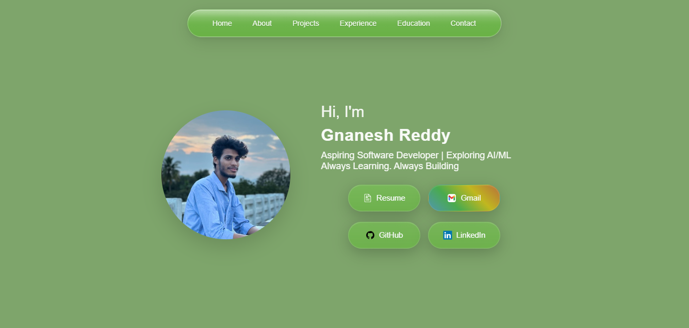
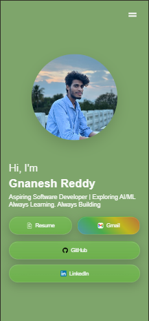

# Gnanesh Reddy Portfolio

Modern developer portfolio built using HTML, CSS, and JavaScript.

## Live Website
https://portfolio-nine-lyart-llqwz3won9.vercel.app/

## Features
- Apple Inspired UI
- Responsive Design
- Glassmorphism Effects
- Smooth Animations
- Mobile Navigation
- Modern Project Showcase

## Tech Stack
- HTML5
- CSS3
- JavaScript
- Vercel

## About
This portfolio showcases my projects, skills, experience, and passion for building modern software solutions and AI-driven applications.
## Preview

### Desktop View

### Mobile View
